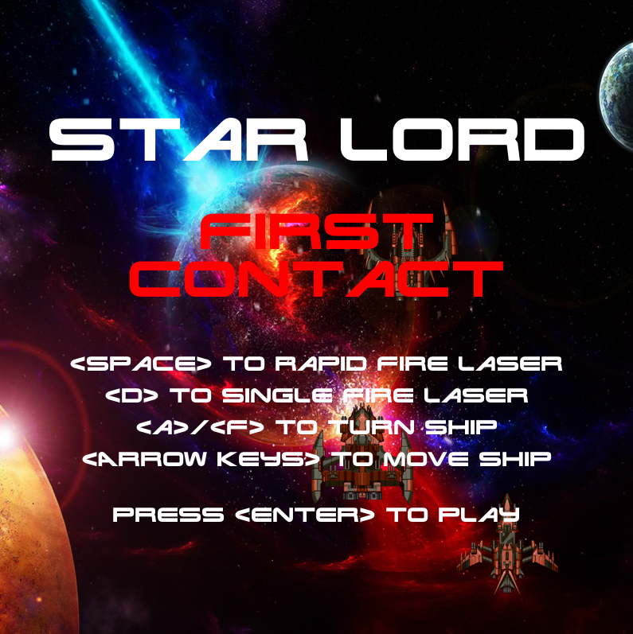

<head>
	<link rel="stylesheet" type="text/css" href="./util/mdstyle.css">
</head>

<h4>NOTE: This README is a work in progress, but its up-to-date enough to get you started<h4>

<h2>[Α] Intro</h2>

+ Star Lord is a third person space shooter based on a game I built while at the University of Mary Washington. It's a heavy object oriented design, coded in C++ while working in the VisualStudio environment. As such, you won't see a Makefile in here - I relied on VisualStudio to do all that under the hood. 

+ Star Lord also relies heavily on the <a href="liballeg.org">Allegro Game Programming Library</a>, which, while robust, has certain limitations compared to other libraries. However, it provides enough 'barebones' functionality to allow Star Lord to be a fully functional - and importantly, entertaining - arcade-like game.

+ The object was to create a game that you might find in an arcade. I've always wanted to purchase an arcade machine for my house; however, the costs are often outrageous, plus there really isn't much you can do with the game after you've played it through. It's static. You can't customize it. Ergo, the Star Lord project was born with the intent of creating the software I could throw into a custom built, stand up arcade machine.

<h2>[Β] Overview of Game</h2>

[]
(https://www.youtube.com/watch?v=W6D129EU3HE)

<h2>[Γ] Getting this code into VisualStudio</h2>

+ Quick run down of what you need to do:

	+ Create a project in Visual Studio. 

	+ Create a dependency on the Allegro library. 

	+ Dump the following directories into the project:

		Target | Purpose
		--- | :---
		/font | Contains the game's font files
		/img | Contains the image files, sprite sheets, etc. 
		/sound | Contains the game's sound effects and voice clips

	+ Create a music directory and add your own music. 

		> All of my code points to a music directory where applicable, but I'm not pushing the actual music file out to this repo. The file itself is Skylar Cahn's "<a href="https://www.youtube.com/watch?v=BFKEl-sXy9o">Quantum Communication</a>", <i>a truly fitting score</i> for Star Lord. However the license owned by gregphillipsminiatures.com doesn't allow me to distribute it with the game package. You'll need to purchase the licensure for your own use. You can find out more about that <a href="http://www.skylarcahn.com/product/quantum-communication/">here</a>. 

	+ Dump the following files into the project:

		Name | Source | Header | Purpose
		--- | :---: | :---: | :---
		asteroid | .cpp | .h | Manages asteroid objects and their behaviors
		crate | .cpp  | .h | Manages crate objects and their behaviors
		enemy | .cpp | .h | Manages enemy ship objects and their behaviors
		friend | .cpp | .h | Manages friendly ship objects and their behaviors
		gameState | .cpp | .h | Responsible for holding the current state of game (points, health, progress)
		gameplay | .cpp | .h | Responsible for managing the progression and flow of the game
		hull | .cpp | .h | Manages the hull which enemy ships crash into
		laser | .cpp | .h | Manages the player's laser cannon
		main | .cpp | | Driver program and program entry point
		soldier | .cpp | .h | Manages the video communication overlay of friendly soldier
		special | .cpp | .h | Manages the special objects contained in the crates
		weapon | .cpp | .h | Manages the player ship and its movement

+ Detailed run down of how to do this:

	+ TODO 

<h2>[Ψ] Credits to Other Artists</h2>

+ Game Art:

	+ Enemy Ships

		+ 'wubitog' and 'Skorpio'
		+ http://opengameart.org/users/skorpio

	+ Space Background

		+ wallpaperscraft.com
		+ https://wallpaperscraft.com/download/space_planets_takeoff_explosion_96455/1920x1080

	+ Enemy Explosion Animation

		+ 'Aj_'
		+ https://opengameart.org/content/explosion-sprite

	+ Friendly Explosion Animation

		+ 'nuvorm' via AS3
		+ http://hasgraphics.com/tag/explosion/

	+ Asteroid Animation

		+ 'para'
		+ https://opengameart.org/content/low-poly-rocks

	+ Destoryed Asteroid Animation

		+ 'MrBeast'
		+ https://opengameart.org/content/smoke-aura

<h2>[Ω] Legal / Disclaimer</h2>

+ TODO

